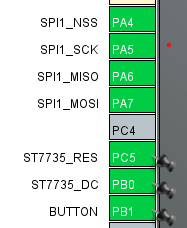

# Ejemplo de uso de la librería LVGL en STM32F407 con DMA

En este ejemplo se prueba la librería LVGL junto con el controlador DMA. El rendimiento obtenido es bastante bueno. Se implementó un controlador para manejar el display tanto con DMA como sin DMA.


## Sin DMA
```c
void my_flush_cb(lv_display_t * display, const lv_area_t * area, uint8_t * px_map)
{
    /* El caso más simple (y también el más lento) para enviar todos los píxeles renderizados a la
     * pantalla uno por uno. `put_px` es solo un ejemplo. Necesita ser implementado por ti. */
    uint16_t * buf16 = (uint16_t *)px_map; /* Supongamos que es un display de 16 bits (RGB565) */
    int32_t x, y;
    for (y = area->y1; y <= area->y2; y++) {
        for (x = area->x1; x <= area->x2; x++) {
            // put_px(x, y, *buf16);
            ST7735_DrawPixel(x, y, *buf16);
            buf16++;
        }
    }

    /* ¡IMPORTANTE!
     * Informar a LVGL que el "flush" ha terminado para que el buffer pueda ser modificado nuevamente. */
    lv_display_flush_ready(display);
}

```

## Con DMA

Aunque aun tenemos que rotar los bytes de los colores, el rendimiento mejora.
```c
void my_flush_cb_with_DMA(lv_display_t * display, const lv_area_t * area, uint8_t * px_map)
{
    /* Asegúrate de que los datos de color estén en el formato correcto. 
     * Si el formato de color está invertido (Little Endian -> Big Endian o viceversa),
     * es necesario invertir los bytes de cada píxel. */

    uint16_t *buf16 = (uint16_t *)px_map;  // Convertir el buffer a 16 bits para facilitar el acceso a cada píxel.

    uint32_t pixel_count = (area->y2 - area->y1 + 1) * (area->x2 - area->x1 + 1);

    // Ajuste de colores invertidos si es necesario
    for (uint32_t i = 0; i < pixel_count; i++) {
        uint16_t color = buf16[i];
        // Invertir el formato de color si es necesario (RGB565)
        // Esto intercambia los bytes alto y bajo (Little Endian -> Big Endian)
        uint16_t inverted_color = ((color & 0xFF00) >> 8) | ((color & 0x00FF) << 8);
        buf16[i] = inverted_color;  // Actualizar el valor del píxel con el color invertido
    }

    // Establecer la ventana de direcciones en la pantalla
    ST7735_SetAddressWindow(area->x1, area->y1, area->x2, area->y2);

    // Activar la línea de datos (DC) para indicar que vamos a enviar datos y no comandos.
    HAL_GPIO_WritePin(ST7735_DC_GPIO_Port, ST7735_DC_Pin, GPIO_PIN_SET);

    // Usar DMA para la transmisión de datos
    HAL_SPI_Transmit_DMA(&hspi1, (uint8_t *)buf16, pixel_count * 2);  // 2 bytes por píxel

    // Esperar la finalización del envío de datos
    // NOTA: Aquí debes esperar a que la transferencia DMA haya terminado,
    // por ejemplo, usando una interrupción o una bandera de "completado".

    // Informar a LVGL que el "flush" se ha completado y que puede modificar el buffer (Se hace en la interrupción de 
    // transmisión SPI completada)
    // lv_display_flush_ready(display);
}

void HAL_SPI_TxCpltCallback(SPI_HandleTypeDef *hspi)
{
    HAL_GPIO_WritePin(ST7735_DC_GPIO_Port, ST7735_DC_Pin, GPIO_PIN_RESET);
    lv_display_flush_ready(display1);
}
```

## Prueba de pantalla TFT ST7735S

La placa **STM32F407VG** se conecta mediante la interfaz serial **SPI1** a una pantalla TFT de **128x128 píxeles** basada en el controlador **ST7735S**.

---

## Conexión de pantalla

<p align="center">
  
  &nbsp;&nbsp;&nbsp;&nbsp;
  
</p>

### Tabla de conexiones
------------------------------------------------
| STM32F407VG           |  Pantalla TFT ST7735S |
|-----------------------|-----------------------|
| SPI1_CLK      `[PA5]` | SCK                   |
| SPI1_MOSI     `[PA7]` | SDA                   |
| SPI1_MISO     `[PA6]` | NO SE USA             |
| SPI1_NSS      `[PA4]` | CS                    |
| ST7735S_DC    `[PB0]` | A0 (dato / cmd)       |
| ST7735S_RESET `[PC5]` | RESET                 |
-------------------------------------------------

Podemos ver que no usamos SPI1_MISO porque el display no devuelve datos y agregamos CS por hardware con SPI1_NSS en PA4. Por otra parte, utilizamos un pin extra llamado ST7735_DC, que sirve para indicar si el flujo a través del SPI1 es un comando o datos.


> ⚠️ **Nota:** Verificar la configuración de pines en el archivo `.ioc` del proyecto, utilizando **STM32CubeMX**.

---


### Ejemplo LVGL funcionando

<div style="display: flex; justify-content: center;">
    
</div>